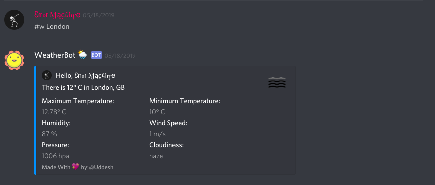

# Discord Weather Bot

Weather bot tells the weather of any given city.

## Project Overview

This bot works with **Discord** and uses *Open Weather API*  to fetch weather information of a given city. You just need to invite it to your *Discord Server* and it starts working.

<p>
    
</p>

## Instructions

1 Go to [this](https://discordapp.com/oauth2/authorize?&client_id=560817962291036161&scope=bot&permissions=8) url.

2 Add bot to your server.

3 Give the necessary permissions.

4 To get weather information run following command.

```
#w <City Name>
```

5 That's it. Now you are able to get the weather at any time anywhere.